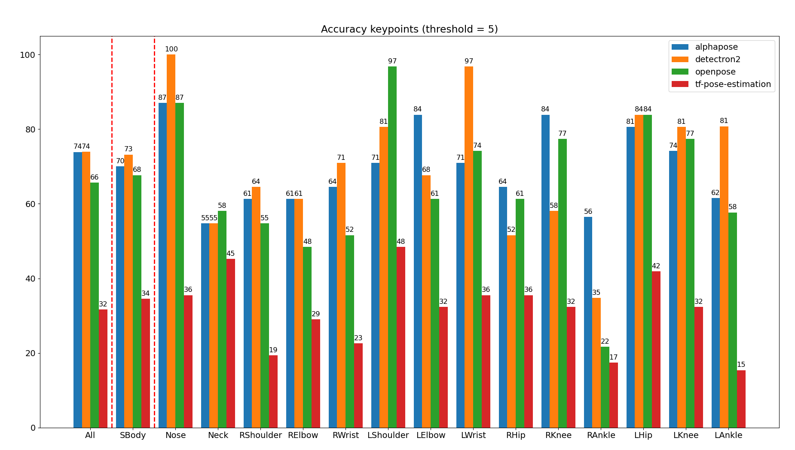
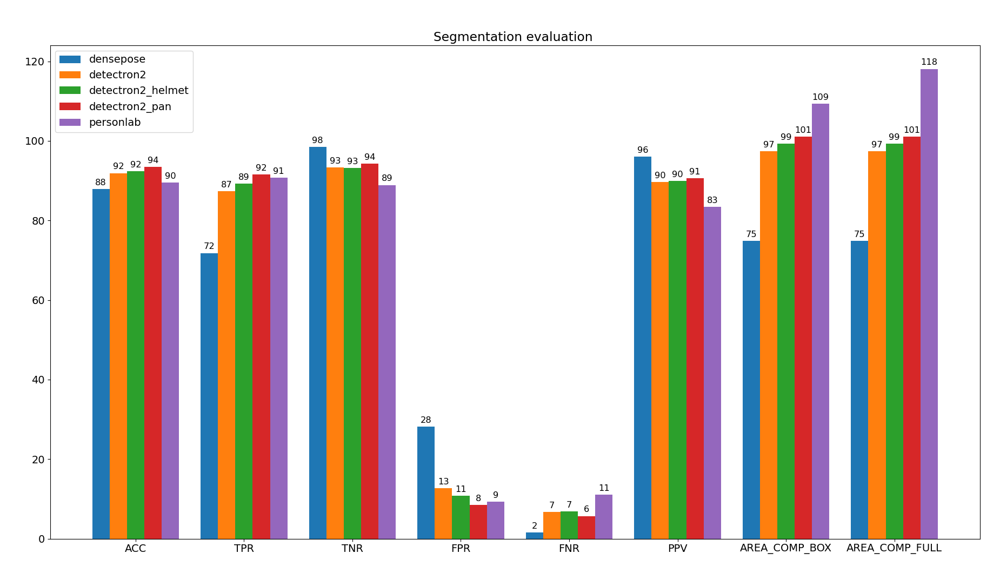

# masterproef_public

This github repository contains a Python project with two main functionalities: 
* A module to compare the results of different pose estimation and person segmentation libraries.
* A module to detect cyclists in video footage, analyse his/her (aerodynamic) features and compare different bike positions.

## Installation
1. Download and install Python3 (https://www.python.org/downloads/). 
2. Append Python to the system path.
3. Install Python packages: numpy, matplotlib, opencv-python
4. For detectron usage install package like described in [detectron_instal.md](project/detectron_env/detectron_install.md)


## Setup

The code is runned on a dataset concluding the necessary output files of the tested libraries. Therefor different Google Colab notebooks are created to generate this code. In this way the data can be imported to compare metrics like accuracy, true positive rate, predicted area.

We made a comparison between following pose estimation libraries:
* [AlphaPose](https://github.com/MVIG-SJTU/AlphaPose)
* [OpenPose](https://github.com/CMU-Perceptual-Computing-Lab/openpose)
* [Detectron2](https://github.com/facebookresearch/detectron2)
* [tf-pose-estimation](https://github.com/ildoonet/tf-pose-estimation)

We made a comparison between following person segmentation libraries:
* [DensePose](https://github.com/facebookresearch/DensePose)
* [Detectron2](https://github.com/facebookresearch/detectron2) instance segmentation
* [Detectron2](https://github.com/facebookresearch/detectron2) instance segmentation with a extension of the helmet mask (detected as sportsball)
* [Detectron2](https://github.com/facebookresearch/detectron2) panoptic segmentation
* [PersonLab](https://github.com/scnuhealthy/Tensorflow_PersonLab)

Of course you are free to test more libraries and include them in the comparison.

For the comparison the following data of the libraries is needed:
A dataset folder including a GROUND_TRUTH folder with the images and the ground truth POSE_ESTIMATION and SEGMENTATION data.
Next to the ground truth folder different the data of different libraries needs to be saved in the POSE_ESTIMATION or SEGMENTATION FOLDER.

The structure for an image dataset with ground truth and test data looks like the following:
```
dataset_example/
├── GROUND_TRUTH
│   ├── images
│   │   └── front_000.jpg
│   ├── POSE_ESTIMATION
│   │   └── front_000.json
│   ├── SEGMENTATION
│   │   └── front_000.jpg
│   └── UBody
│       └── front_UBody.jpg
├── POSE_ESTIMATION
│   ├── alphapose
│   │   └── front_000.json
│   └── detectron2
│       └── front_000.json
└── SEGMENTATION
    ├── detectron2
    │   └── front_000.jpg
    └── personlab
        └── front_000.jpg
```

The json file for pose estimation contains the body keypoints mapped on the point in the image. Different pose estimation libraries generate different output files, a conversion is mostly needed. Below you can find the json format needed for the comparison (for the ground truth data there is no c value, because the certainty is 100%):

```yaml
front_000.json
{
    "people": [
        {
            "Nose": [ x, y, c ],
            "Neck": [ x, y, c ],
            "RShoulder": [ x, y, c ],
            "RElbow": [ x, y, c ],
            "RWrist": [ x, y, c ],
            "LShoulder": [ x, y, c ],
            "LElbow": [ x, y, c ],
            "LWrist": [ x, y, c ],
            "RHip": [ x, y, c ],
            "RKnee": [ x, y, c ],
            "RAnkle": [ x, y, c ],
            "LHip": [ x, y, c ],
            "LKnee": [ x, y, c ],
            "LAnkle": [ x, y, c ],
            "REye": [ x, y, c ],
            "LEye": [ x, y, c ],
            "REar": [ x, y, c ],
            "LEar": [ x, y, c ]
        }
    ]
}
```

## Run comparison between libraries
To run the comparison you have to use the following syntax:
```
python3 project/code/main_evaluate.py DATA/dataset_example/
    --compare-pose
    --compare-segmentation
    --kps-threshold 5
    --plot-folder plots
    --img-set front side
```




## Run analysis and comparison between videos using dataset
```
python3 project/code/main_analyse.py DATA/dataset_videos/videos/ 
    --pose-folder DATA/dataset_videos/POSE_ESTIMATION/alphapose/ 
    --seg-folder DATA/dataset_videos/SEGMENTATION/detectron2/ 
    --mask-interest-folder DATA/dataset_videos/mask_interest/
    --plot-folder plots
    --analyse-rate 30
    --img-set front side
```

## Run analysis and comparison between videos using detectron2
First install detectron2 as python module (only on Linux/MacOS)
```
source project/detectron_env/bin/activate
python3 project/code/main_analyse.py DATA/dataset_videos/videos/ 
    --mask-interest-folder DATA/dataset_videos/mask_interest/
    --plot-folder plots
    --analyse-rate 30
    --img-set front side
```
